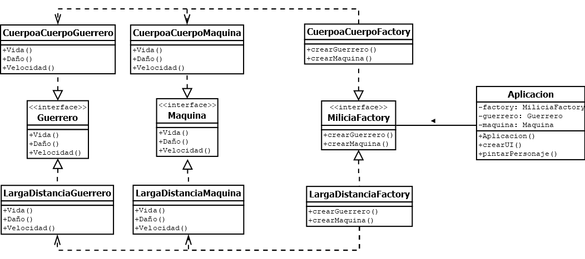

# Patrones_creacionales
Patrones creacionales - Diego Armando Hernandez Chavez - Javier Alejandro Sanchez Salamanca - Kevin Santiago Ramirez Montoya

Patron de diseño: Abstract Factory.
Descripción del proyecto: Proyecto realizado usando el patron Abstract Factory,
este posee dos fabricas, una de guerreros y maquinas cuerpo a cuerpo (CuerpoaCuerpoFactory), y la otra de guerreros y maquinas larga distancia (LargaDistanciaFactory), según lo desee el usuario se generaran objetos cuerpo a cuerpo o larga distancia con caracteristicas particulares dadas por el personaje y la maquina elegida por el programa. 